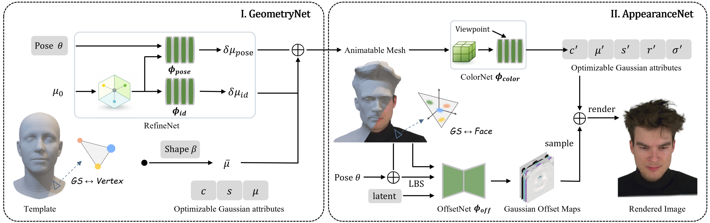

# MGAvatar: Mesh-Bound Gaussians for Head Avatar Geometry and Appearance Modeling

<div align="center">

  <br>

[project](#) / [arxiv](#) / [video](#demo)

</div>

## Overview

We propose an end-to-end framework for high-fidelity head avatar reconstruction with mesh-bound Gaussians. In the geometry stage, FLAME parameters, vertex-bound Gaussians, and a pose-dependent deformation network are jointly optimized to refine identity-specific head geometry. In the appearance stage, face-bound Gaussians and Gaussian attribute offsets model fine-grained appearance, while a grid-based view-conditioned neural field improves color consistency under novel poses and expressions.

<div align="center">
  
</div>

### Demo

<div align="center">
  <video src="media/video.mp4" controls width="90%"></video>
</div>

## Installation

Our environment setup follows the installation procedure of [GaussianAvatars](https://github.com/ShenhanQian/GaussianAvatars).

Please refer to the original [GaussianAvatars installation instructions](https://github.com/ShenhanQian/GaussianAvatars/blob/main/doc/installation.md) for the environment configuration and required dependencies.

The main steps include:

1. Create the required Conda environment.
2. Install the corresponding PyTorch and CUDA dependencies.
3. Install the required packages.
4. Install the CUDA extensions and other dependencies required by the Gaussian Splatting pipeline.

> **Note:** Please make sure that the CUDA, PyTorch, and compiler versions are compatible with the requirements of the corresponding Gaussian Splatting and rendering components.

## Dataset

We use the same datasets and data preprocessing pipeline as [GaussianAvatars](https://github.com/ShenhanQian/GaussianAvatars).

Please follow the [GaussianAvatars dataset preparation instructions](https://github.com/ShenhanQian/GaussianAvatars/blob/main/doc/download.md) to download and preprocess the required data.

The dataset preparation includes:

* Downloading the required head-avatar datasets.
* Preparing the FLAME-related files.
* Preparing camera parameters and facial tracking results.
* Organizing the processed data according to the expected directory structure.

After preparation, please make sure that the dataset paths in the configuration files are correctly set to your local paths.

## Usage

### 1. Training

To train an MGAvatar model, simply run:

```shell
./run.sh
```

Please make sure that:

* The required dataset has been downloaded and preprocessed.
* The dataset paths are correctly configured.
* The required FLAME and tracking files are available.
* The environment has been installed successfully.

The training script will automatically perform the required optimization stages and save the trained model to the configured output directory.

### 2. Rendering

After training, use the following command to render the trained avatar:

```shell
./render.sh
```

The rendering script loads the trained MGAvatar model and generates the corresponding rendered results.

The output directory and rendering settings can be configured in `render.sh`.


## Acknowledgements

Our implementation is based on and inspired by several excellent open-source projects, including:

* [GaussianAvatars](https://github.com/ShenhanQian/GaussianAvatars)
* [Gaussian Splatting](https://github.com/graphdeco-inria/gaussian-splatting)
* [NVDiffRec](https://github.com/NVlabs/nvdiffrec)
* [NVDiffRast](https://github.com/NVlabs/nvdiffrast)

We thank the authors for their valuable contributions to the community.

